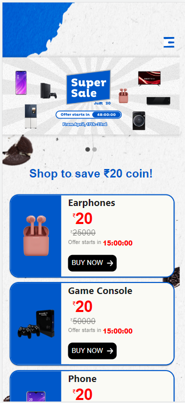
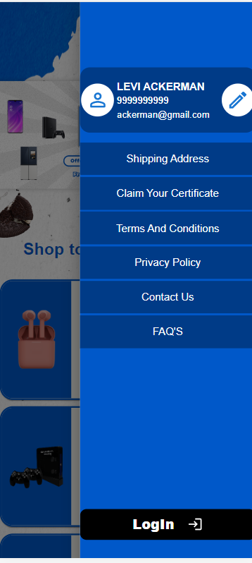
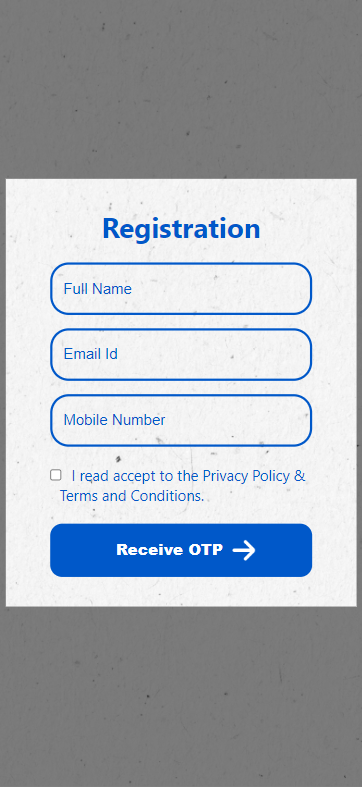
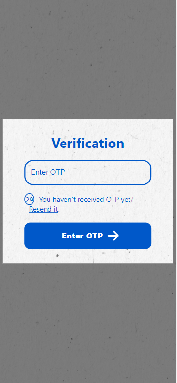
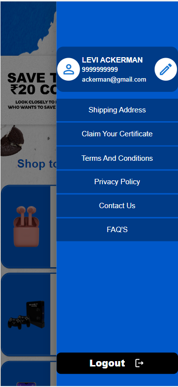

# Tecnology used :
1. React and TypeScript
2. Built in Component=>MUI
3. state Management=>Redux Toolkit
4. API =>axios
5. Navigation=>react router dom
6. Mock Server=>Express JS

# Steps to run :
1. install vite
2. install dependency using npm install if in case fail use "npm install --force"
3. up express js for mock api response
4. run command "npm run dev"

Please find output screenshot  in output folder

### This only a Mobile Responsive Application .

## Mobile-View :

### Homepage :
)

### Drawer :
)

### Registration Page :
)

### OTP Page :
)

### Logout Page :
)

